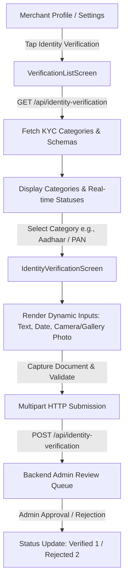

# KYC Identity Verification Feature Documentation

This document explains the end-to-end working mechanism, architecture, step-by-step user flow, and API interactions of the **KYC (Know Your Customer) / Identity Verification** feature in the PaySecure Merchant Mobile App.

---

## 📌 Architecture Overview

The KYC feature in the PaySecure Merchant Mobile App is designed using a **Dynamic Form-Driven System**. Instead of hardcoding document input fields in Flutter, the mobile application dynamically fetches required document categories and field schemas directly from the backend API.

---

## 🚀 Step-by-Step Merchant Workflow

### Step 1: Navigating to Identity Verification
- Merchant navigates to **Profile Settings** screen ([profile_setting_screen.dart](file:///c:/Users/erson/Downloads/sk/01_PaySecure-Mobile_App/03_Merchant_Mobile_App/Source%20Code/project/lib/views/screens/profile/profile_setting_screen.dart)).
- Merchant selects **Identity Verification**.

### Step 2: Fetching Category List & Verification Status
- The app invokes `VerificationController.getVerificationList()`.
- Sends `GET` request to `ENDPOINT_URL: AppConstants.verificationUrl` (`/api/identity-verification`).
- Renders [verification_list_screen.dart](file:///c:/Users/erson/Downloads/sk/01_PaySecure-Mobile_App/03_Merchant_Mobile_App/Source%20Code/project/lib/views/screens/verification/verification_list_screen.dart) displaying document categories (e.g., Identity Card, Address Proof, Business License) alongside status badges:
  - 🟡 **Pending (Status 0)**: Submitted & awaiting admin review.
  - 🟢 **Approved (Status 1)**: Verified and active.
  - 🔴 **Rejected (Status 2)**: Verification failed; resubmission allowed.
  - ⚪ **Required (Status null)**: Document submission required.

### Step 3: Dynamic Form Rendering
- Tapping a document category triggers `VerificationController.filterData()`.
- Navigates to [identity_verification_screen.dart](file:///c:/Users/erson/Downloads/sk/01_PaySecure-Mobile_App/03_Merchant_Mobile_App/Source%20Code/project/lib/views/screens/verification/identity_verification_screen.dart).
- The screen parses the server JSON schema and dynamically builds:
  - **Text / Number Input Fields** (e.g., Document ID number, Full Name).
  - **Date Selectors** (e.g., Date of Birth, Issue/Expiry Date).
  - **Document Photo Upload Areas** (Camera / Gallery photo capture).

### Step 4: Document Image Capture & Size Validation
- Tapping photo upload triggers `VerificationController.pickFile(fieldName)`.
- Uses `ImagePicker` (Camera default) to take document pictures.
- Validates image file size:
  - If image file exceeds **4 MB**, displays an alert message: `"Image size exceeds 4 MB. Please choose a smaller image."`
  - Otherwise, constructs `http.MultipartFile` for upload.

### Step 5: Multipart Submission to Backend
- Merchant taps **Submit Verification**.
- Invokes `VerificationController.submitVerification()`.
- Sends `POST` multipart HTTP request to `AppConstants.identityVerificationUrl`.
- Upon successful submission, returns to the category list screen and updates state to **Pending**.

### Step 6: Verification Gating (`VerificationCheckScreen`)
- Crucial merchant transactions (such as withdrawal requests or store payouts) are guarded by [verification_check_screen.dart](file:///c:/Users/erson/Downloads/sk/01_PaySecure-Mobile_App/03_Merchant_Mobile_App/Source%20Code/project/lib/views/screens/verification/verification_check_screen.dart).
- Unverified merchants are prompted to complete KYC before proceeding.

---

## 🛠️ Codebase Component Mapping

| Layer | File / Class | Responsibility |
| :--- | :--- | :--- |
| **API Endpoints** | [app_constants.dart](file:///c:/Users/erson/Downloads/sk/01_PaySecure-Mobile_App/03_Merchant_Mobile_App/Source%20Code/project/lib/utils/app_constants.dart) | Defines `verificationUrl` and `identityVerificationUrl` endpoints. |
| **Repository** | [verification_repo.dart](file:///c:/Users/erson/Downloads/sk/01_PaySecure-Mobile_App/03_Merchant_Mobile_App/Source%20Code/project/lib/data/repositories/verification_repo.dart) | HTTP network calls (`ApiClient.get`, `ApiClient.postMultipart`). |
| **Controller** | [verification_controller.dart](file:///c:/Users/erson/Downloads/sk/01_PaySecure-Mobile_App/03_Merchant_Mobile_App/Source%20Code/project/lib/controllers/verification_controller.dart) | Handles state management, dynamic schema parsing, image picking & form validation. |
| **Status List UI** | [verification_list_screen.dart](file:///c:/Users/erson/Downloads/sk/01_PaySecure-Mobile_App/03_Merchant_Mobile_App/Source%20Code/project/lib/views/screens/verification/verification_list_screen.dart) | Displays list of document categories with live status badges. |
| **Form UI** | [identity_verification_screen.dart](file:///c:/Users/erson/Downloads/sk/01_PaySecure-Mobile_App/03_Merchant_Mobile_App/Source%20Code/project/lib/views/screens/verification/identity_verification_screen.dart) | Generates dynamic input controls and document upload UI. |
| **Guard UI** | [verification_check_screen.dart](file:///c:/Users/erson/Downloads/sk/01_PaySecure-Mobile_App/03_Merchant_Mobile_App/Source%20Code/project/lib/views/screens/verification/verification_check_screen.dart) | Prevents unauthorized merchant operations until KYC is complete. |

---

## 📊 Status Codes Reference

| Code | Value | Action in App |
| :--- | :--- | :--- |
| `null` | **Required** | Opens dynamic submission form. |
| `0` | **Pending** | Shows yellow pending banner; submission disabled. |
| `1` | **Verified** | Shows green tick badge; full access granted. |
| `2` | **Rejected** | Shows red alert banner; merchant can re-submit documents. |
